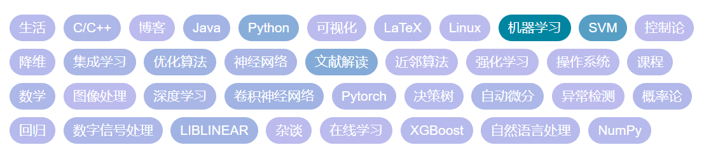

## :smile: Hi!

### Who am I?

Welt Xing, an undergraduate in AI school, Nanjing University. My interests include:

- Machine learning model and their implementation.
- Deep learning method and framework.
- Machine learning theory (Interested but know little).

In [my blog](https://welts.xyz), I record what I've learn:

### My stat

### Some naive work

- [libsvm-sc-reading](https://github.com/Kaslanarian/libsvm-sc-reading): A Chinese version manual to explain how [LIBSVM](https://github.com/cjlin1/libsvm) works.
- [PySVM](https://github.com/Kaslanarian/PySVM): A NumPy implementation of SVM based on SMO algorithm.
- [PyDyNet](https://github.com/Kaslanarian/PySVM): Deep learning framework implementation using Numpy based on Autodiff.
- ...

### 
