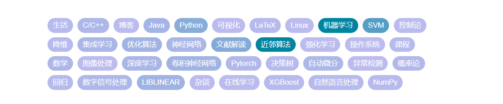

## :smile: Hi! Nai elen siluva lyenna.

In Quenya, "Nai elen siluva lyenna" means "may the stars shine on you".

### Who am I?

Welt Xing, an undergraduate in AI school, Nanjing University. In Germany, "welt" means "the world". My interests include:

- Machine learning model and their implementation.
- Deep learning method and framework.
- Machine learning theory (Interested but know little).
- Graph learning.

In [my blog](https://welts.xyz), I record what I've learn:

### My stat

Your stars, forks and issues are most welcome and appreciated :partying_face:.

### Some fininshed and undating work

- [libsvm-sc-reading](https://github.com/Kaslanarian/libsvm-sc-reading): A Chinese version manual to explain how [LIBSVM](https://github.com/cjlin1/libsvm) works.
- [PySVM](https://github.com/Kaslanarian/PySVM): A NumPy implementation of SVM based on SMO algorithm.
- [PyDyNet](https://github.com/Kaslanarian/PyDyNet): Deep learning framework implementation using Numpy based on Autodiff.
- [SAGOD](https://github.com/Kaslanarian/SAGOD): A library for anomaly detection on static attributed graph.

### Some ongoing work

- A cpp matrix/tensor implementation, and some algorithm (det, inv, svd, etc) based on it.
- Anomaly detection on traffic.
- A GNN framework based on PyDyNet.
